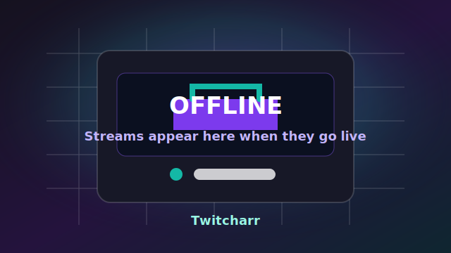

# Twitcharr

Twitcharr is a Twitch live-TV plugin for [Dispatcharr](https://github.com/Dispatcharr/Dispatcharr). It creates Dispatcharr Channels, Streams and XMLTV guide data from Twitch channel names or discovery tokens.

No Twitch account login, OAuth token, API key, Client ID or Client Secret is required. Twitch metadata is fetched anonymously through Twitch's public web GraphQL endpoint.

Important: Twitcharr can download and use the third-party [`streamlink-ttvlol`](https://github.com/2bc4/streamlink-ttvlol) Streamlink plugin. The author is not affiliated with Twitch, Dispatcharr, streamlink-ttvlol or any proxy operator. Use at your own risk and follow the rules that apply to your setup.

## What Works

| Feature | Status |
|---|---|
| Twitch channel input | Channel names can be separated by commas or line breaks. Twitch URLs also work. |
| Discovery tokens | Supports `top`, `top:de:25`, `game:Just Chatting:10` and `search:gronkh`. |
| Dispatcharr objects | Creates and updates managed Channels, Streams, StreamProfile and EPG rows. |
| XMLTV | Writes `<data_dir>/twitch.xmltv`. |
| Offline handling | Can keep offline channels with the bundled offline card, remove offline channels, or keep one placeholder when the lineup is empty. |
| Offline icon | Includes a bundled offline card from `twitcharr/assets/offline.svg`. |
| Adaptive quality | Measures bandwidth and updates the Streamlink quality fallback chain. |
| ttv.lol update | Downloads the latest `twitch.py` for Streamlink when requested or scheduled. |
| Emby / Jellyfin | Triggers the server's Refresh Guide task after scheduled EPG refreshes if URL and media-server token are configured. |
| Diagnostics | Includes connection, proxy and bandwidth checks. |

Built-in offline card:



Plugin settings screenshot:


## Install

### Import ZIP

1. Zip the `twitcharr/` folder, or use `twitcharr.zip` from this repository.
2. Open Dispatcharr.
3. Go to Plugins.
4. Import the ZIP.
5. Enable Twitcharr.

### Copy Folder

1. Copy `twitcharr/` into `/app/data/plugins/` inside the Dispatcharr container.
2. Refresh the Dispatcharr plugin list.
3. Enable Twitcharr.

Actions screenshot:


## Quick Setup

Open the Twitcharr plugin settings and fill **Twitch channels / discovery**.

Comma-separated channel names:

```text
gronkh, papaplatte, knossi
```

Line-separated channel names:

```text
gronkh
papaplatte
knossi
```

Twitch URLs:

```text
https://www.twitch.tv/gronkh
```

Discovery tokens:

```text
top:de:25
game:Just Chatting:10
search:trymacs
```

Then click **Sync now**.

Twitcharr will refresh Twitch metadata, write XMLTV and EPG rows, sync Channels and Streams, update the StreamProfile and start the scheduler if enabled.

Do not paste OAuth tokens, API keys or Twitch account credentials into the channel field. They are not used.

Live TV grid screenshot:


## Discovery Tokens

| Token | Meaning |
|---|---|
| `gronkh` | Adds one channel by channel name. |
| `top` | Adds the top 10 live streams globally. |
| `top:25` | Adds the top 25 live streams globally. |
| `top:de:25` | Adds the top 25 German-language live streams. |
| `top:de,en:50` | Adds the top 50 streams in German or English. |
| `game:Just Chatting` | Adds the top 10 streams in that category. |
| `game:Just Chatting:25` | Adds the top 25 streams in that category. |
| `search:gronkh` | Adds the first 10 channel-search results. |
| `search:cooking:5` | Adds the first 5 channel-search results. |

For category or search names that contain commas, put the token on its own line.

Guide detail screenshot:


## Important Settings

| Setting | Default | What it does |
|---|---|---|
| Twitch channels / discovery | empty | Channel names, URLs or discovery tokens. Commas and line breaks are accepted. |
| Stream quality | `adaptive` | Builds a Streamlink quality fallback chain from measured or manual bandwidth. |
| Connection bandwidth (Mbps) | `0` | `0` uses the last measured value or a conservative fallback. |
| Bandwidth safety margin (%) | `50` | Extra headroom used by adaptive quality. |
| Show offline channels | on | Keeps offline streamers in the lineup with the bundled offline card. Turn off to prune them while offline. |
| Offline card | bundled SVG | Image used for offline channels and the placeholder. Source: `twitcharr/assets/offline.svg`. |
| Always keep no-streams placeholder | on | Keeps one placeholder channel only when the lineup would otherwise be empty. |
| EPG refresh interval | `2` minutes | Scheduler interval for Twitch status and guide refresh. |
| Daily ttv.lol update time | `00:00` | Scheduler time for the daily forced `twitch.py` refresh. |
| ttv.lol proxy servers | EU defaults | Comma-separated proxy playlist URLs. Clear to disable. |
| Emby / Jellyfin URL | empty | Optional media-server base URL. |
| Emby / Jellyfin access token | empty | Optional media-server token for Emby/Jellyfin only. This is not a Twitch key. |
| Auto-check for plugin updates | on | Checks GitHub Releases every 6 hours. |
| Auto-apply plugin updates | on | Applies newer GitHub Releases automatically; reload/restart Dispatcharr afterwards. |
| Data directory | `/app/data/plugins/twitcharr` | Stores XMLTV, state and the downloaded Streamlink plugin. |

Quality settings screenshot:


## Actions

| Action | Use it for |
|---|---|
| Sync now | Full setup and refresh. |
| Measure bandwidth | Runs quick download probes, saves Mbps and updates adaptive quality. |
| Check / update ttv.lol | Checks the installed release and redownloads the latest `twitch.py` in one action. |
| Uninstall | Removes managed Dispatcharr objects, clears the XMLTV file and triggers a media-server guide refresh. |

Health-check screenshot:


## Offline Behavior

`Show offline channels` controls real streamer channels:

- ON: offline streamers stay visible with offline guide data and the bundled offline card, even if nobody is live.
- OFF: offline streamers are removed during sync and recreated when they go live.

`Always keep no-streams placeholder` controls the placeholder:

- ON: if no real streamer entry is in the lineup, one placeholder channel remains.
- OFF: if nobody is live and offline channels are disabled, all managed Twitch channels are removed.

## EPG And Images

Twitcharr does not burn guide data into the video stream. That would require video overlays or transcoding and would make the stream worse.

Instead it writes guide data where TV clients expect it:

- Dispatcharr `EPGData` and `ProgramData` rows
- `<data_dir>/twitch.xmltv`
- channel icons
- programme icons in XMLTV with landscape and portrait hints when available
- programme titles focused on the current stream state, without repeating the channel name in Emby
- stable game/profile artwork for live channels and the bundled offline card for offline channels

For Emby and Jellyfin, the plugin triggers the server's Refresh Guide task after scheduled EPG refreshes. That is still required because those servers cache Live TV guide data.

## Troubleshooting

| Problem | What to try |
|---|---|
| No channels appear | Check channel names, then run **Sync now**. |
| OAuth/API-key confusion | Remove Twitch OAuth/API-key text from the channel field. Twitcharr does not need Twitch credentials. |
| Offline channels do not disappear | Turn **Show offline channels** off, then run **Sync now**. |
| Streams do not start | Run **Check / update ttv.lol**. |
| `streamlink` is missing | Install Streamlink in the Dispatcharr container. |
| Guide looks stale | Run **Sync now**. |
| Emby/Jellyfin does not update | Set both server URL and media-server token, then run **Sync now**. |
| Stuttering | Run **Measure bandwidth** or increase the safety margin. |

## Sources

- [Dispatcharr](https://github.com/Dispatcharr/Dispatcharr)
- [streamlink-ttvlol](https://github.com/2bc4/streamlink-ttvlol)
- [twitch2tuner](https://github.com/micahmo/twitch2tuner)
- [Streamlink plugin sideloading](https://streamlink.github.io/latest/cli/plugin-sideloading.html)
- [Streamlink Twitch plugin docs](https://streamlink.github.io/latest/cli/plugins/twitch.html)
- [Jellyfin Scheduled Tasks API](https://api.jellyfin.org/#tag/ScheduledTasks)
